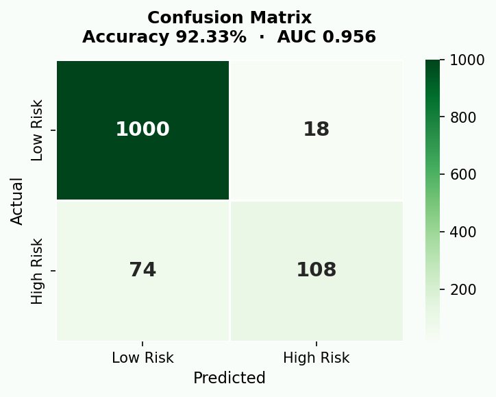
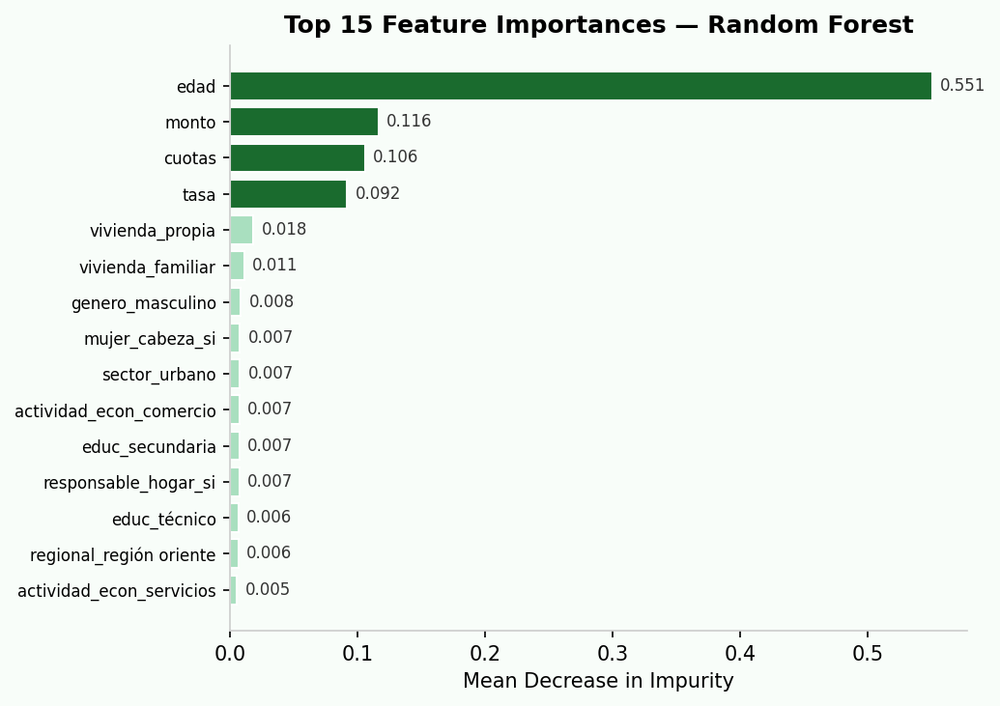
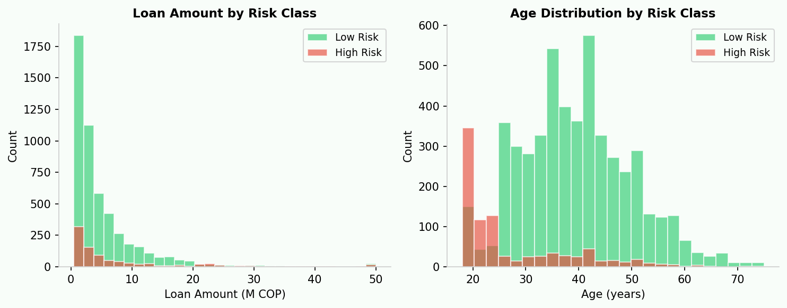
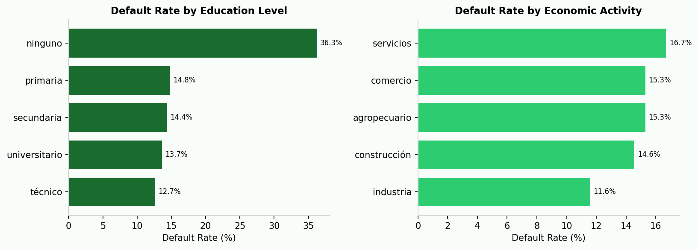

<div align="center">

# 💳 DS4A — Loan Payment Risk Predictor
### Fundación Amanecer · Correlation One DS4A Program · Team 84

[](https://huggingface.co/spaces/nicoaspace/ds4a-loan-predictor)
[](https://python.org)
[](https://gradio.app)
[](https://scikit-learn.org)
[](LICENSE)

**Predicting microcredit default risk with machine learning to support financial inclusion in Colombia.**

[🚀 Live Demo on Hugging Face Spaces](https://huggingface.co/spaces/nicoaspace/ds4a-loan-predictor) · [📓 EDA Notebook](DataWrangling.ipynb) · [📊 Front-End Plots](Front%20End%20Plots%20Colocacion.ipynb)

</div>

---

## 🎯 Problem Statement

[Fundación Amanecer](https://www.fundacionamanecer.com.co/) is a Colombian microfinance institution that provides microcredits to low-income entrepreneurs in underserved communities. As the loan portfolio grows, identifying borrowers at risk of default becomes critical to sustaining the foundation's social mission.

**Goal:** Build a machine learning classifier that predicts whether a loan applicant is at **high risk of default**, enabling data-driven lending decisions and reducing non-performing assets.

---

## 📊 Model Performance

The final **Random Forest** model achieves strong performance on the held-out test set:

| Metric | Score |
|--------|-------|
| **Accuracy** | **92.33%** |
| **AUC-ROC** | **0.956** |
| Test set size | 1,200 samples |

### Confusion Matrix



### Top 15 Feature Importances



The most predictive features are **loan amount**, **age**, **interest rate**, and **number of installments** — all numerical. Among categorical features, **economic activity** and **education level** carry the most signal.

---

## 📈 Data Insights

### Loan Amount & Age by Risk Class



### Default Rate by Borrower Profile



Key findings:
- Borrowers **under 25** have significantly higher default rates
- **Larger loan amounts** correlate with higher risk
- **Rural sector** borrowers tend to be slightly more reliable
- **Education level** is a meaningful predictor: borrowers with no formal education default more often

---

## 🔬 Features Used

| Category | Feature | Description |
|----------|---------|-------------|
| 💰 Loan | `monto` | Disbursed credit amount (COP) |
| 💰 Loan | `cuotas` | Number of payment installments |
| 💰 Loan | `tasa` | Monthly nominal interest rate |
| 👤 Borrower | `edad` | Borrower's age |
| 👤 Borrower | `genero` | Gender |
| 👤 Borrower | `educ` | Highest education level completed |
| 👤 Borrower | `estado_civil` | Marital status |
| 🏠 Household | `vivienda` | Housing type (owned / rented / etc.) |
| 🏠 Household | `mujer_cabeza` | Female head of household |
| 🏠 Household | `responsable_hogar` | Responsible for household expenses |
| 📍 Geography | `regional` | Geographic region |
| 📍 Geography | `sector` | Urban or rural sector |
| 💼 Economic | `actividad_econ` | Primary economic activity |

---

## 🤖 Modeling Approach

```
Raw loan portfolio data
        │
        ▼
   Data Wrangling
   ─────────────
   • Join cartera + colocación datasets
   • Datetime parsing & feature extraction
   • Remove outliers (extreme balances)
        │
        ▼
  Feature Engineering
  ───────────────────
  • StandardScaler  → numerical features
  • OneHotEncoder   → categorical features
        │
        ▼
   Model Training
   ──────────────
   • SVM Classifier (baseline)
   • Random Forest  (final model, 300 trees)
        │
        ▼
   Evaluation & Deployment
   ─────────────────────────
   • Confusion matrix · AUC-ROC
   • Gradio app → Hugging Face Spaces
```

### Why Random Forest?
- Handles mixed numerical + categorical features naturally
- Provides interpretable feature importances
- Robust to outliers and missing values
- No extensive hyperparameter tuning needed for strong baseline performance

---

## 🚀 Run Locally

```bash
git clone https://github.com/nicoaspace/DS4A-Final-project.git
cd DS4A-Final-project

pip install -r requirements.txt
python app.py
```

Then open `http://localhost:7860` in your browser.

> **Note:** The live demo runs on **synthetic data** that mirrors the real feature schema. The original loan portfolio data is proprietary to Fundación Amanecer.

---

## 🗂 Repository Structure

```
DS4A-Final-project/
├── app.py                    ← Gradio demo app (HF Spaces entry point)
├── requirements.txt          ← Python dependencies
├── amanecer_app.py           ← Original Dash prototype
├── DataWrangling.ipynb       ← Exploratory data analysis
├── Front End Plots *.ipynb   ← Interactive visualization notebooks
├── Dash app/                 ← Multi-page Dash dashboard
│   ├── app.py
│   ├── pages/
│   │   ├── cartera.py        ← Loan portfolio page
│   │   ├── colocacion.py     ← Loan origination page
│   │   ├── client_seg.py     ← Client segmentation page
│   │   └── predictive.py     ← ML prediction page
│   └── components/
│       ├── data/             ← Data loading utilities
│       ├── models/           ← Trained model files (local only)
│       └── plots/            ← Chart components
└── docs/images/              ← README chart assets
```

---

## 🛠 Tech Stack

| Layer | Technology |
|-------|-----------|
| ML | scikit-learn (Random Forest, SVM) |
| Data | pandas, NumPy |
| Visualization | Matplotlib, Seaborn, Plotly |
| Dashboard | Dash + Dash Bootstrap Components |
| Demo App | Gradio 4.x |
| Deployment | Hugging Face Spaces |

---

## 👥 Team 84 · DS4A Colombia · 2022

Built as the **Final Project for the DS4A (Data Science for All)** program by Correlation One — a 16-week intensive data science training for Colombian professionals.

---

<div align="center">

Made with ❤️ for Fundación Amanecer

</div>
